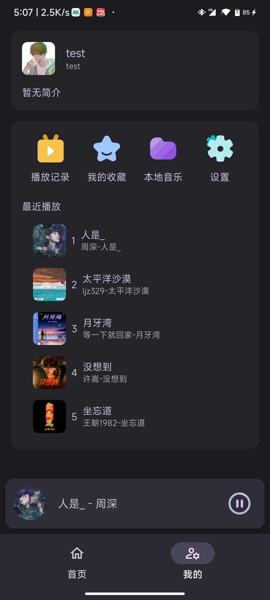
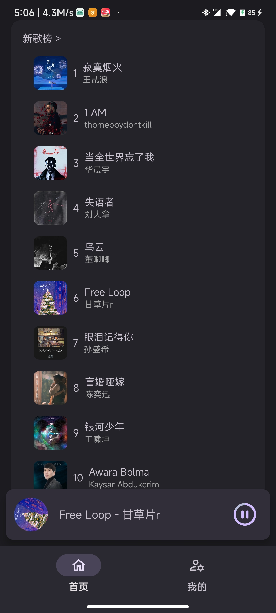
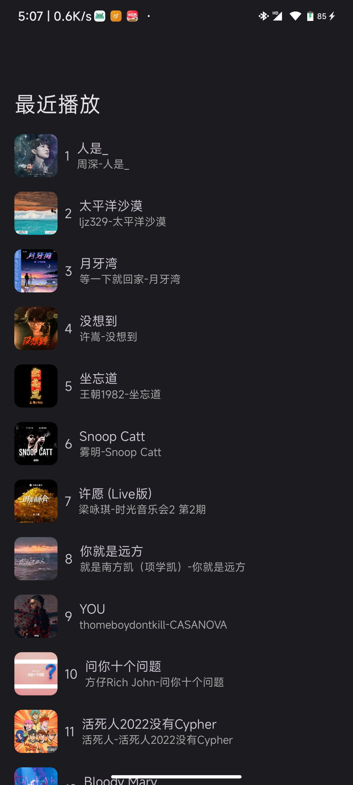
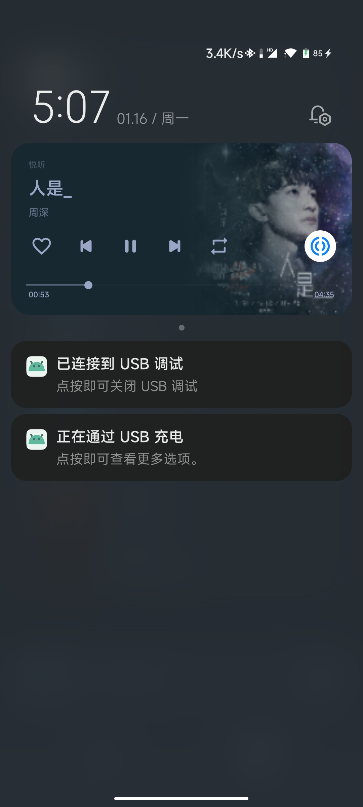
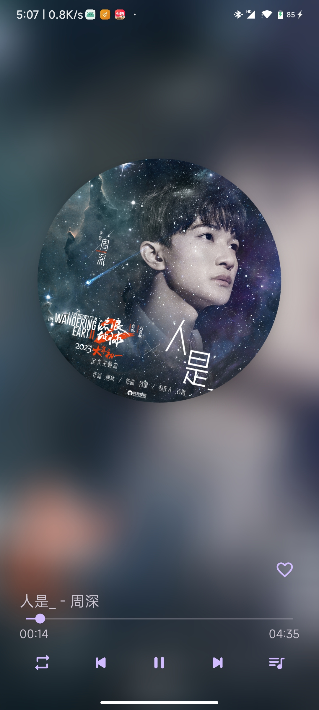
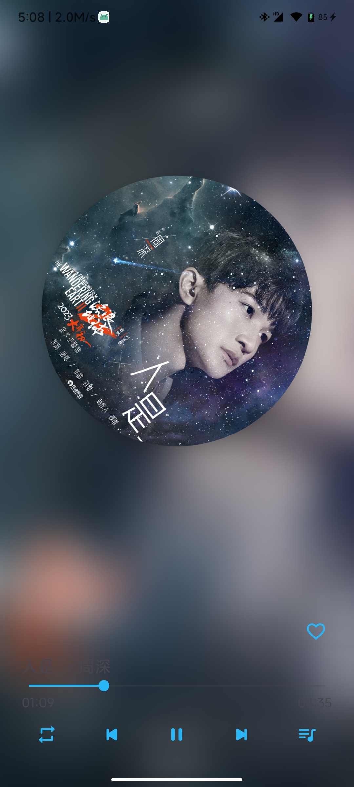
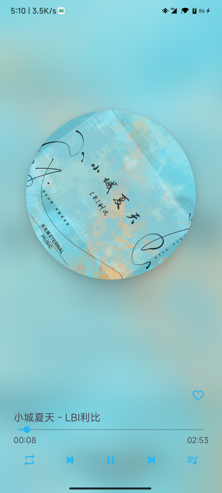
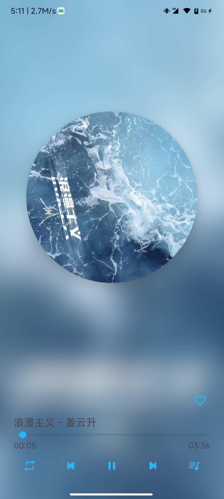
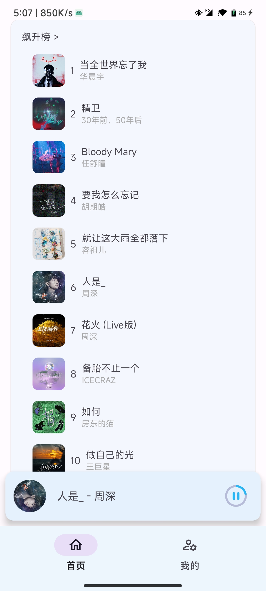
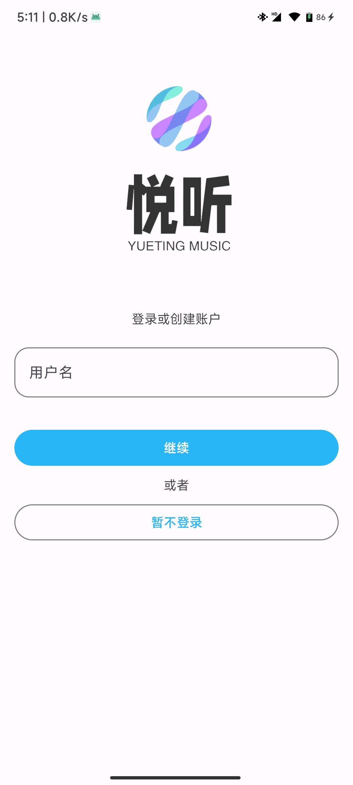

# yuetingmusic 悦听音乐

## 一款优美的Android音乐播放App, 使用 Material you (Material 3) 设计

### 特点

漂亮UI，支持耳机线控，通知栏播放效果炫酷（使用官方MediaSessionCompat 框架），耳机断开自动暂停（防止噪音），打开别的音乐或者视频会自动暂停（防止混音，实现方式：android.media.AudioManager）

- 说明：由于一些原因，第一个版本使用java编写，现已全部转 kotlin（只是简单转换，未使用Kotlin特性优化代码），可能存在Bug
- 架构：mvvm
- 播放框架：android.support.v4.media.session.MediaSessionCompat
- 媒体播放器框架：Exoplayer

- 网络请求：retrofit+rxjava , 后续仅使用retrofit+kotlin协程

- 数据库：Litepal 库操作sqlite
- UI架构：单Activity+jetpack navigation+xml+Material 3 MDC组件+fragment，后续仅使用单Activity+jetpack navigation+jetpack compose (Material 3)
- 图片加载：Glide+glide-transformations，后续会加入coil
- 权限请求：permissionx，后续会改为 jetpack compose permission 库
- 分页：viewpager2
- 事件：eventbus
- cookie管理：com.github.thomas-bouvier:persistent-cookie-jar-okhttp:1.0.2
- 音乐Api：https://github.com/Binaryify/NeteaseCloudMusicApi （声明：音乐api仅用于学习）
- 登录功能：由于一些原因，登录功能仅为本地登录（后续会改成api登录），新版本已经改为验证码登录（未完善），本地登录暂时关闭，仅支持访客登录，账号：手机号，密码：短信验证码
- 收藏，播放记录：这些目前都基于本地账户
- 首页榜单：未做优化，有bug，可能会请求大量数据
- 播放器界面：未做深浅背景优化，后续可能会用 androidx.palette:palette:1.0.0 这个库优化
- 下载体验：https://github.com/wilinz/yuetingmusic/releases
- UI效果图如下：

